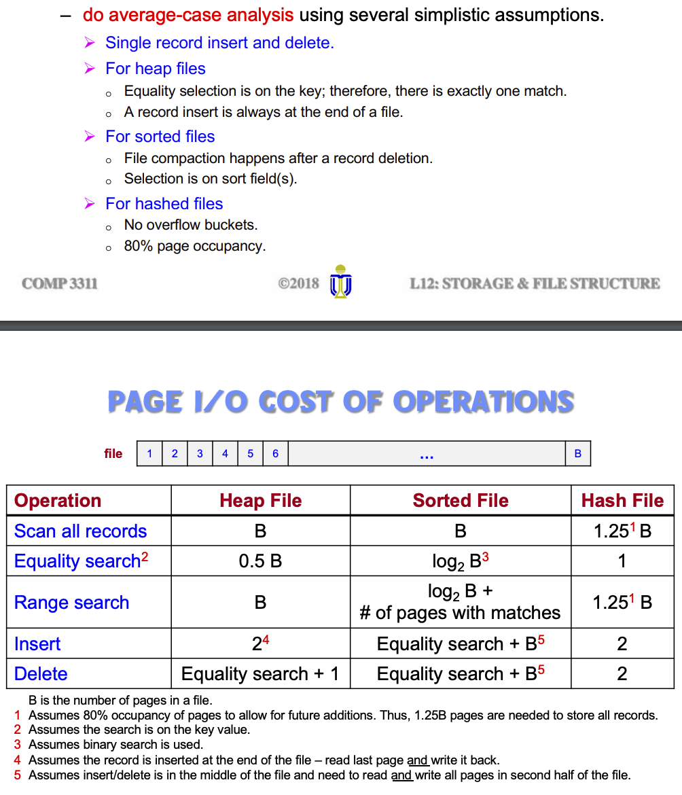

## L12, Storage and File Storage

Hierarchy
- Primary: cache, RAM
- Secondary: flash, magnetic disk
- Tertiary: optical disks, tapes
(ordering is based on cost from high to low, capacity reliability from low to high)

- use main for current data, secondary for main, tertiary for older versions

Magnetic Disks
- platter spins, arm moves to desired tracks to position `head` (`cylinder/track` is everything accessible from the arm at radius)
- 1 `head` for read and write at a time
- sector is the smallest unit

- better than tapes for random access
  - pages/block is the units DB retrieves in
- DBMS: read, write -> to/from RAM

Disk Page Access
- seek time (4-15ms)
- rotational latency (2-7ms)
- transfer time (1ms) for each 4kb
- sequential I/O is better because of seek and rotational latency <- worst part of performance

Storage Access
- keep as many pages in memory as possible
  - call them **buffer**
- buffer manager try and minimize disk access
  - has a *replacement policy*

Buffer Manager
- app make request, manager may take in buffer by allocation/throwing out page
  - write only if modified

Buffer Replacement Strategy
- LRU strategy most common
- bad strategy for access pattern thats repeated scans
  - MRU is better
- DBMS has own buffer manager that uses stats to determine replacement strat

File Organization
- DB stored as files -> sequence of records -> sequence of fields
- record sized assumed fixed, file usually record one type, different file for different relations

Blocking Factor
- Blocking factor of file r is $bf_r = {bytes per page}/{bytes per record}$

## Fixed length records
Basic
- store record `i` starting from byte `n * (i - 1)`
- easy access, record may cross pages 
  - not allowed, just add empty space at end of page
- when `i` is deleted, shift records up
- moving record inside page is not good when there's pointers

Free Lists
- do not move records in page, store address of first deleted record in header (first record)
  - that would store the second deleted record
- more space efficient

## Variable Length Record
- used for `varchar`, multiple types of record in file etc.
- Simple, Bad solution: byte string, add a end of record symbol -> lead to fragmentation and limit growth of record

Reserved Space
- use fixed length record of a known max length
- unused space is filled with null
- a lot of unused space

Pointer Method
- anchor page (main page, first record)
- overflow page (everything but those in the first records of chain)
- uses pointer at end of each record to link to next (overflow can link to another overflow)

Slotted Pages
- Header: number of entries, end location of free space
- location and size of each record
- records can move around within a page to keep them contiguous, entry gets updated
- references point to the entry for record in header, not the direct pointer!

## Record Organization in Files
- Heap - record anywhere in file where there is space
- Sequential - stored in sequence
- Hashing - has function on some attr, result specifies where it should be stored

Heap
- easiest, as file grow, disk page is allocated
- keep track of pages, free space, and records (used with the slotted page)
- can also use 
  - linked list (header for full and free data pages)
  - page directory (header pages pointing to data pages)

Sequential
- ordered, better for sequential processing
- pointer chains, pointer gets updated
  - use overflow page when too many entries
- may need to reorganize file to maintain the benefit of sequential order

Hashing File
- optimize for business scenarios for fields, basically do indexing on a field
  - over allocate to allow for future insertion
  - create a hashing function that determines which page (**bucket**) it goes into
- when buckets are full, overflow buckets
- great for single queries, for range queries it may be bad because they may fall into many buckets (more reads)

Analysis of File Organization
- ignore CPU
- approximate I/O
- do avg case analysis

## Data Dictionary Storage
AKA system catalog -> store metadata (data of data)
- has info about relations, physical file organization, indices, statistical data, user accounts etc.

- metadata storage can use 
  - specialized data structure
  - a set of relations to give better access efficiency <- preferred

DBMS uses mostly sequential or hashing
