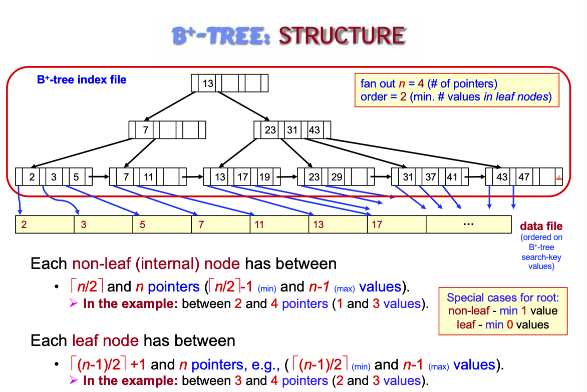
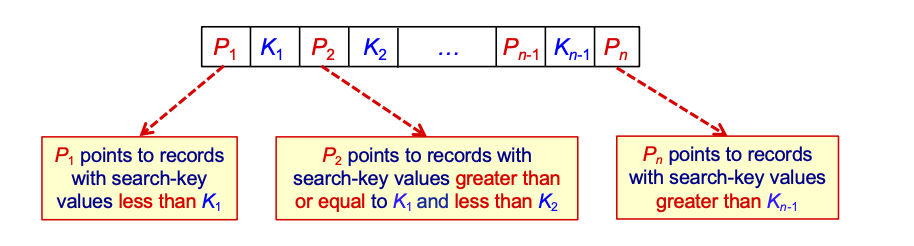
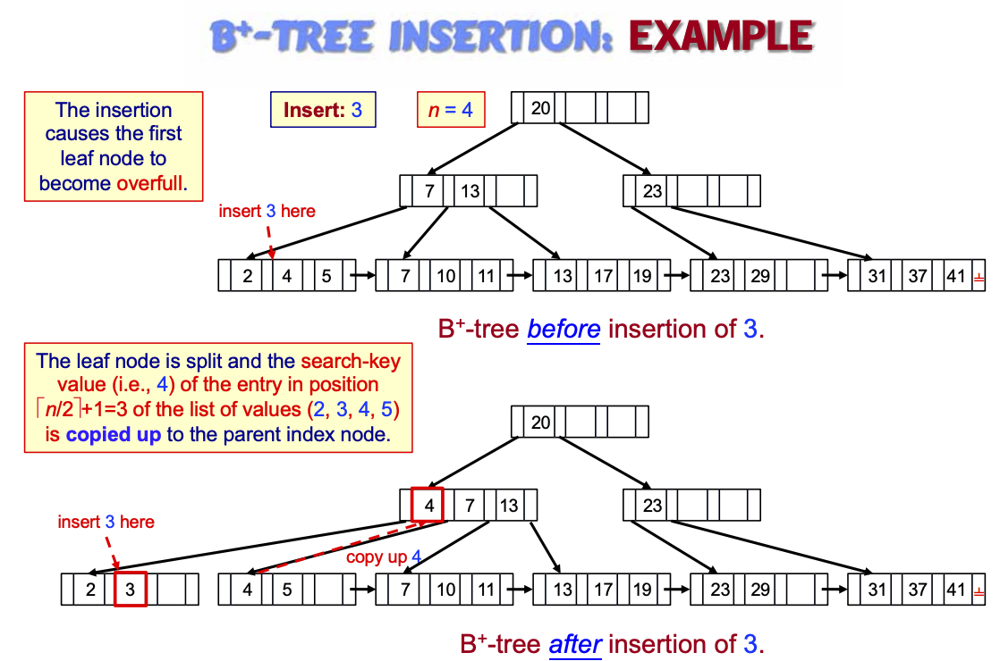
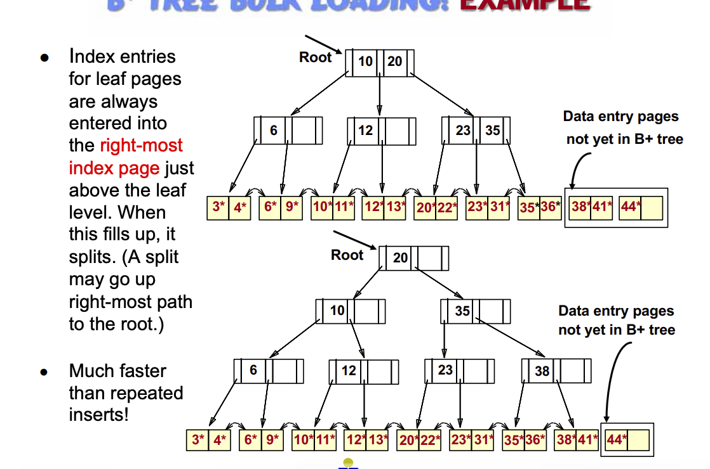

# L13, Indexing

Costs every time we bring a page into memory, hence we want to minimize that, like how we would if we were manually scanning a book
- major cost is how many pages we read

We can keep the file stored in a format (ie. sorted), add new **index**
- index entry: small record, almost like Key<->Value (value being the page)
  - Key would be called the *search key*
- Since the value is `page number` you don't need to store a `index entry` for each item
- the cost would be (for BS) -> $log_2{# of pages} + 1$ where you add 1 for accessing the catalog page
- you can keep indexing on the index -> reduce the costs even further!!
  - (add 1 for each level you add to get to the actual page)

Search Key: attribute or set of attribute used to search fo records
- not the same as primary/candidate
  - primary is always a search key
  - search key might not be a primary key

Index File: records of `<search key, pointer>`

Ordered index (where the key is sorted) (also called jefftree index)
- good for equality and range search
- cost height of tree + 1
- index page is called `index node`
- number of children of index node is `fan-out`
- height = $log_{fanout}(# index entries)$

Primary vs Secondary index
- primary index = clustering index
  - index for which *file* is sorted on the search key
  - index-sequential file: ordered sequntial file with primary index - ISAM
- Secondary Index = non-clustering index
  - index for which *file* is not sorted on search key

Sparse vs Dense Index
- Sparse: index entry for some search-key values (only for primary)
  - e.g. HKID has only for first record in each page of file -> Sparse
  - would require a sequential search after locating the page
  - less over space and maintenance for insert/delete
- Dense Index: every search-key value

When building a non-search-key index, you can make a secondary dense index
  - the new index must be secondary and *dense* usually for secondary (since file is not sorted on the secondary index)
  - secondary is almost as good as primary -> more space, and expensive for querying many entries

Ordered Index on Non-Candidate Key
- 1. Use variable length index entries
  - each entry contains a bunch of pointers (harder to implement)
- 2. Use multiple index entries per name (redundant)
- 3. Most common: extra level of indirection
  - index entry point to a list/bucket that contains the pointer

## L14, Indexing 2

Index Sequential Files performance degrades overtime because of overflow pages
- periodic reorg is needed

B+ tree index files auto reorganize itself with small local changes
- no periodic reorder
- they're just good

B+ tree structure

- balanced tree: all path from node to leaf are same length
- fan-out: maximum number of pointers/children - `n`
- order: $\lceil\frac{n-1}{2}\rceil$, min number of value in leaf node
- Special case: 
  - if root is not a leaf: has 2 children at least
  - if root is a leaf, it can have 0 to (n-1) values.

Non-leaf node
- form a multi level sparse index

Leaf Node
- each pointer `P` either point to:
  - file record wit search key value `K`
  - or a bucket of pointers each have a search key value of `K`
- Search key values are in sorted order
- Last pointer P point to next leaf node, or end symbol

Why it is good
- the pages does not need to be physically close - non-sequential also works
- non-leaf is sparse index
- small number of levels - logarithmic, search is not bad
- insert and deletion is better, index can be restructured easily

B tree can be both dense and sparse at the node level

### B tree on primary key

records are ordered by primary and the leaf nodes can contain all or just some key values point to record in file
- can point to 1 or several values (dense vs sparse)

### B tree on candidate key
- contain *all* of the key values, has to be dense
  - might be unique pointing to unordered values
  - might be pointing to the start of a ordered sequence
  - might be pointing to a list of pointers, which points to unordered values

### Query
- Query like a BST
- if there's `K` search key values in file. path no longer than $\lceil\log_{\lceil\frac{n}{2}\rceil}(K)\rceil$
- A node is generally the same size as a disk page -> 4KB, n is around 100 (40 bytes per index entry usually)

### Insertion

- can be recursive
- growth to 1 more level at the top

Do 1 level at a time, at the time of division
- $\lceil{n/2}\rceil + 1$ gets moved up initially, then it is $\lceil{n/2}\rceil$ that gets pushed up (note it is 1 indexed in desc)

### Deletion
- if LEAF has less than $\lceil{(n-1)/2}\rceil$ then need to redistribute by borrowing from sibling mode
  - if not possible, the merge L and sibling

When adjusting and redistributing, need to adjust the parent nodes

pick any when merging

### B Tree file organization
- index file degradation problem solved by using indexes
  - same for data files
- leaf nodes in a B tree file organization stores records instead
- since records are large, the max number of records is less than pointers in non-leaf
  - leaf nodes needs to be half full!!
- involve more siblings in redistribution -> results in each node having at lease 2n/3 entries, lessening possibility of merge/split

### Bulk Loading
- bulk loading is more efficient (inserting 1 by 1 is slow)
- initialization: sort all, insert pointer to first leaf in new page
- Index always entered into right most index page, when this fills up, split on the right most path

# L15, Hash Index and Bitmap Index

Hash index organizes the search keys and their record pointer into a hash file structure
- secondary indexes

Hashing considerations
- function should assign values randomly
- overflow: avoid long chains of overflow

Static Hashing Functions
- ideal hash is random, so each has same number of records 
- typical hash function computes on the internal binary representation of search key
  - eg. binary of all characters added and then modulo

Handling of Bucket Overflow
- because of 
  - insufficient number of bucket
  - chosen hash function is skewed, many have same value -> non uniform
- overflow bucket is used and chained together
  - bad practice

deficiencies of static hashing
- 