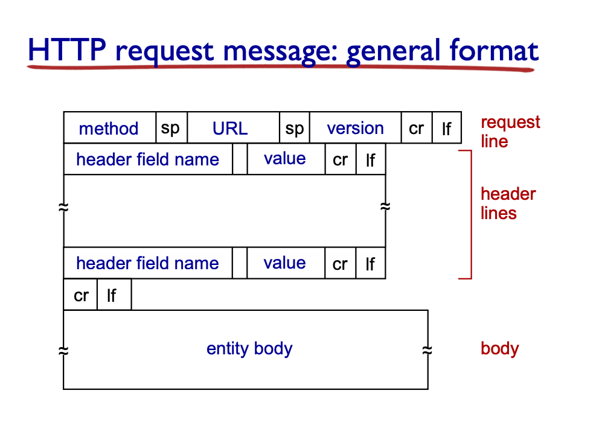

## Chapter 2, Application Layer

- Network Apps: email, web, text messaging, VoIP, P2P file sharing, gaming etc.

Network App:
- run on different end systems, communicate cross network
- No need to write network core software, they don't run anything, this way end systems handle everything
- P2P vs Client-Server


Client-Server Arch
- Server permanent IP address, always expected to be up
- Client talk to server, connected periodically, dynamic IP, do not talk to each other

P2P
- No always on server
- end systems talk to each other, request from each other, self scaling
- Need to manage each other's IP changes

Process Communication
- process: program running within host
  - inter-process communication via OS
- server: wait for messages, client: send messages (this is similar in concept with P2P)

Socket
- process send and receives messages from sockets 
- transport infra to deliver message to socket at other process
- processes will have id: unique 32 bit IP address
  - also needs processes' ID (many process on same host)
- port number will specify the process
  - HTTP: 80
  - Mail: 25
  - etc.


Application layer controlled by developer, everything controlled by OS, communicated via Socket
  - Defines: type of messages, syntax, semantics, rules
  - Open protocols defined in RFCs (HTTP, SMTP)
  - also has proprietary protocols (Skype)

Transport service
- data integrity: 100% reliability at times
  - some tolerate loss (audio)
- timing: low delay
- throughput: minimum amount
- security

Internet Transport protocols
- TCP: reliable
  - flow, congestion control
  - Does not guarantee timing, minimum throughput
  - connection oriented, setup required (handshaking)
- UDP
  - unreliable data transfer

Securing TCP
- neither offer encryption, so that needs to be done in Application Layer
  - Apps uses SSL libraries that talk to TCP
  - end-point authentication
  - passwords etc can be sent encrypted

## Web and HTTP
webpage has a html file, then many objects

HTTP: Hypertext Transfer Protocol
- follow client server protocol
- uses TCP
  1. initiates connection (create socket to server, 80)
  2. server accepts connection
  3. HTTP message sent
  4. TCP closed
- HTTP is stateless (no idea about prev requests)
  - stateful protocols are hard to maintain, esp when server/client crashes

Connections
- non-persistent HTTP
  - at most 1 object sent over TCP, then connection closes
  ```
  <establish initial connection>
  <send/receive http request>
  <close connection>
  ^repeat for all objects
  ```
  - RTT = time for a small packet to travel back and forth
  - HTTP response time: 1 RTT for initial connection, 1 RTT for http request + file transmission (2RTT + file)
  - browser might open multiple connections for referenced objects
- persistent HTTP
  - multiple object sent over single TCP connection
  - server leaves connection open after response, subsequent message from the open connection, sends request as soon as it see a referenced object, 1 RTT for all referenced object

HTTP request message
- request vs response
- request line, then header, then carriage return (ending header lines), then rest of everything
  - `\r` -> carriage return character
  - `\n` -> line feed character
- Request form
  
- Uploading Input
  - POST method, including form input, in entity body
  - URL method, put it in request line
  - HTML 1.0 -> GET/POST/HEAD(leave object out of response)
  - HTML 1.1 -> 1.0 + PUT (upload file to specified in URL field) and DELETE

HTTP response
- status line, then header line, then data
- `HTTP/1.1, 200 OK\r\n`
- Status code:
  - 200 -> OK
  - 302 -> Moved Permanently
  - 400 -> Bad Request
  - 404 -> Not Found
  - 505 -> HTTP version not supported

User-server state: cookies
- keep track of user and state (create unique ID, entry backend to link with ID)
- 4 parts
  - cookie header line of response message
  - cookie header line in next request
  - cookie file kept in user's host (managed by browser)
  - back-end database at website keeping track of the cookie's ID

Cookies usefulness
- auth, state, recommendation, sessions
- cookies permit sites to learn a lot about you


Web Caches
- satisfy client without going to server
  - web accesses via cache, if exist in cache return, else fetch, cache then return
- acts as both client and server
  - installed by ISP to save traffic and time (allow for poor content providers to still deliver, like P2P)
- Total delay = internet delay + access delay + lan delay
  - access delay would be high if the access link usage to public internet is large
- increasing access link is not cheap and not easy
  - use cache

Conditional Get
- dont send object if object not updated (If-Modified-Since), no object transmission
  - cache specify the date
  - if modified, then return the new object and status 200
  - if not modified since then, then return `304 Not Modified` and no data

Electronic Mail
- 3 major components
  - User Agents
  - Mail Server
  - Simple Mail Transfer Protocol (SMTP)
    - transfer between mail server
- User Agent
  - "mail reader"
  - compose, editing, reading etc. (mail clients)
- Mail Server
  - mailbox containing incoming messages for user
  - queue for outgoing messages
  - SMTP protocol between servers to send messages (acts as both client and server)
- SMTP (RFC 2821)
  - TCP to reliably transfer email message from client to server: port `25`
  - direct transfer, server to server
  - 3 phases: handshaking -> transfer -> closure
  - messages must be 7bit ASCI
  - command and response (like http request and response)

Process
- send message from UA to own server, then becomes queue
- open connection via TCP, sends message over TCP agent to other server
- open via UA

Final words with SMTP
- SMTP uses persistent connections
- request message to be in 7bit ASCI (instead of ASCII)
- CRLF.CRLF for end of message
- HTTP uses pull, SMTP uses push
- both have ASCII command/response interaction + status
- SMTP: multiple object in multipart message

Mail message format
- has Header with To, From, subject that is diff than the SMTP commands
- has body, which is the actual message

SMTP: delivery/storage to server

Access protocol
- POP (Post Office Protocol RFC 1939): auth and download
- IMAP: Internet Mail Access Protocol (1730): more features, including manipulation of stored messages on server
- HTTP as well

POP3 protocol
- authorization phase: user and password
- transaction phase
- download and delete mode, downloads copy to local, cannot re-read mail if change client
  - copies across different client, stateless across sessions

IMAP
- keep messages in one place - servr
- allow user to organize in folter
- keep user state (name of folder and mappings)

## DNS
DNS - domain name system
- people have many ID, internet host have many IP address (UID) and name (yahoo.com)
- DNS: distributed database, hierarchy of name servers
- Application Layer Protocol: hosts, NS to communicate to resolve names
  - complexity at network edge
- DNS service: hostname to IP translation
  - host aliasing: canonical and alias name
  - mail servers, load distribution
- Cannot be centralized obv.
- Root DNS to other types of domain, then to more specific ones
  - from `.com` to domain to alias

Root Name Servers
- contacted by name servers that cannot resolve name
  - contacts authoritative servers if not known to get mapping, return mapping

TLD
- responsible for `com`, `org` etc.

Authoritative DNS
- Organization's own DNS server providing hostname to IP mappings for named hosts
- maintained by organization 

Local DNS 
- each ISP has one, default name server
- when host make query, it is send to local one first (acts as proxy/cache)

Resolution:
- iterative: go to each one at a time
- recursive: put resolution on contacted server, they will keep reaching to other (heavy load at higher level of hierarchy)

Caching, updating records
- once any NS learn mapping it caches the mapping
  - cache entry disappear after TTL
  - TLD servers are usually cached here (so root NS not visited)
- cached entries may be out of date (best effort name ot address)
  - sometimes needs to wait till all TTL expire)
- RFC 2136 - global update/notify arch

DNS: distributed DB storing resource records (RR)
- name, value, type, ttl
- type:
  - A -> name is host name, value is IP
  - NS -> name is domain, value is hostname of authoritative name server for domain
  - CNAME -> name is alias, value is canonical name
  - MX -> value is the mailserver associated with name

DNS protocol, messages
- query and reply messages, both with same message format
  - header: 16 bit for query, reply
  - flags for another 16 bit
    - specify query or reply, recursion avail, is it authoritative
  

Inserting records into DNS
- register at DNS registrar
  - insert 2 RR into TLD server
  - create type A and MX for website


Attacking DNS
- DDoS, not successful, often filtered, caches allowing root server to by pass (TLD not taken down, server still get fucked)
  - bombard TLD server = death
- redirect attacks
  - man in the middle, intercept queries
  - DNS poisoning, send bogus replies to DNS, which caches it
- exploit DNS for DDoS
  - send query with spoofed source address

## P2P
Pure P2P
- no always on server
- end system will communicate directly, peers are randomly connected and changes IP address
  - Bit Torrent
  - VOIP
  - Streaming

File distribution
- peer upload/download is limited resources
  - increases linearly with number of files downloaded for server-client (N as in number of clients)
- P2P
  - send one file down at least, then each client will download file copy
  - the each lien will download a copy, and aggregate must download NF bits, but that increases too as there's more people hosting file
- linear vs log

Napster
- 160k simultaneous online user at peak
- Centralized directory, once connected, post all available MP3
- select what to download from peer
- Efficient from centralized, but single point of failure and bottle-necked behavior
- Have an index server (centralized)

Gnutella
- made by AOL, but then did not scale up properly
- fully decentralized
- some bootstrapping server to keep some peer nodes, new node contact bootstrapping server and a list of peer then is given
- would give response via graph search, inefficient
- but more robust and no server needed

KaZaA: Hybrid
- decentralized centralized clusters, sacrifice anonymity for efficiency
- each node is either super-node or assigned to one
- each super-node knows other ones
- "Super-peer" P2P system (super index servers)

BitTorrent
- files divided into 256kb chunks, peer in torrent share chunks with each other
- tracker: track peers participating in torrent
- torrent: group of peers exchanging chunks of file
- peer joining torrent, has no chunk but will accumulate over time from other peers
  - register with tracker, connect to some peers
- churn: come and go
- requesting chunks:
  - each peer have a different subset of chunks, ask for list and request chunks on rarest first basis
- sending chunks: tit-for-tat
  - send chunks to those 4 peers that sendsto her at highest rate
  - others are chocked (re-evaluate 4/10 seconds)
  - 30 second: randomly add a new peer, start sending chunks (optimistically unchoke)
- tit for tat
  - highest trading partner will stay

DHT (Distributed Hash Table)
- distributed P2P database
- distribute table over millions of peers
  - peer queries each other with key
  - convert each key to an integer, assign integer to each peer, then put the KVP in the peer with the closest integer
- closest = immediate successor (wrap around)
  - peer only aware of successor and predecessor (overlay network)
  - will go in circular fashion, with some shortcuts
  - O(logN)

Handling Churn
- periodically ping for successor, keep track of 2 successor

### CDN (Content Distribution Network)
Video streaming and content distribution networks
- since video streaming takes a lot of bandwidth, single server will not work
- solution: distributed, application-level infra
- Video
  - sequence of image at constant rate
  - spacial coding (lower # bit sent per image)
  - temporal (one to the next)
- CBR: constant bit rate
  - encoding is fixed
- VBR: variable
  - video encoding rate changes as spacial and temporal coding changes

DASH
- Dynamic Adaptive Streaming over HTTP
- Server: divide video into chunks, each stored and encoded at different rates
  - manifest file: URL for different chunks
- client
  - periodically measure bandwidth
  - consult manifest and request 1 chunk at a time
    - choose max coding rate for bandwidth, can switch over time.
- Client is intelligent
  - decide when to get chunk, at what encoding rate and where to request


CDN
- 1 server does not scale, long path, congestion and 1 point of failure
- store multiple copies at different locations
  - enter deep: push deep into access network
  - bring home: small number of large clusters in POPs near access networks
- subscriber request contents from CDNs
  - multiple of these everywhere
- Over the Top (OTT)
  - from which CDN to take, what behavior for congestion, what content in each one
- needs to resolve at least one more authoritative DNS for the CDN network

## Socket Programming
socket: door between application process and end-to-end protocol (transport layer)
- UDP
  - no "connection" between client and server
  - no handshake, just attaches to address + port and leave whenever
  - can be out of order, unreliable
- TCP
  - must contact server (server must be running and have door)
  - TCP creates a new socket for server to communicate with that client
    - after attaching to port
    - both side needs to close the socket


## Summary Notes
- Application Layer Protocols
  - focus on only communication (only the protocols)
  - not the whole layer
- port number determine processes
  - 4 tuple (2 diff ip, 2 diff ports) determine a unique pair of communication
- socket between application layer and network layer
- push vs pull for sockets

Non-persistent HTTP
- multiple parallel TCP connections, requires 2RTT before getting file, but allows for overall time reduction because parallel

Always needs 2 RTT for the initial HTML file, then request objects (2RTT each vs 1RTT overall)

FTP
- out of band protocol for file transfer via 2 diff TCP connections
  - HTTP and SMTP are in band
- initiates ftp at 21, then uses port 20 for new TCP connection for file transfer (1 TCP per file transfer, non-persistent)
- FTP server keeps state (control info about user), hence limits number of ftp sessions that can coexist
- Out of band because of control TCP at a different port
  - Because it uses a separate connection for the control information

Mail
- Web-based mail, HTTP used to send mail to server and grab mail as well

Root servers
- 13 in Internet, in NA, operate like single server (each is cluster of replicated server)
- TLD for domains
  - Network Solutions for .com
  - Educase for .edu

P2P
- u is basically uploading to internet
- d is download to local, usually d > u
