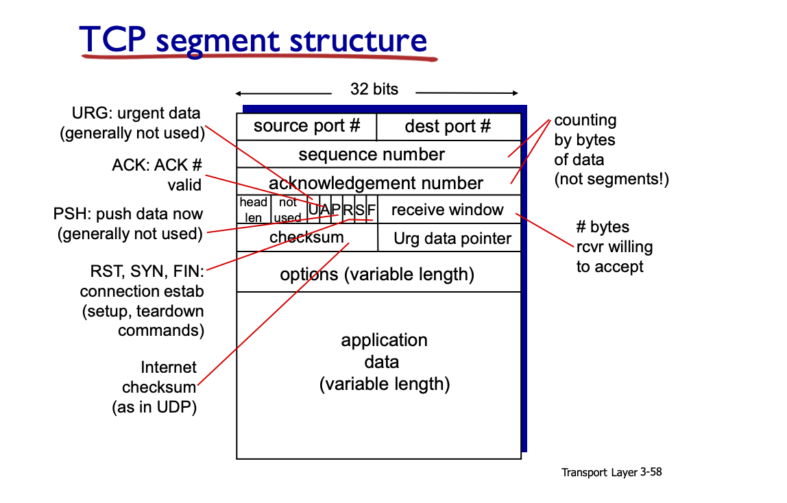
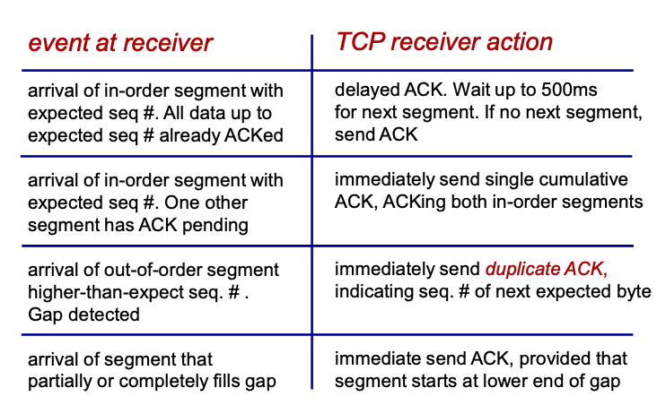
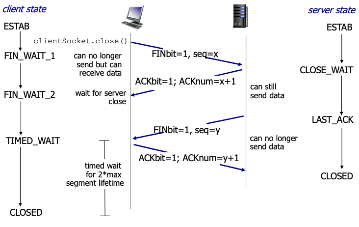
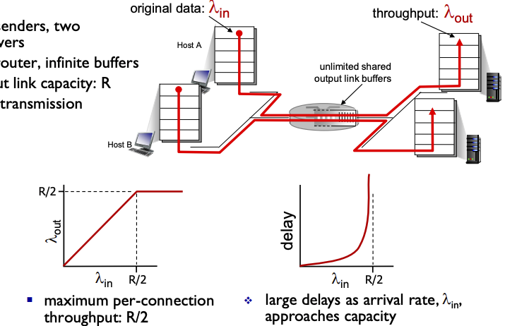
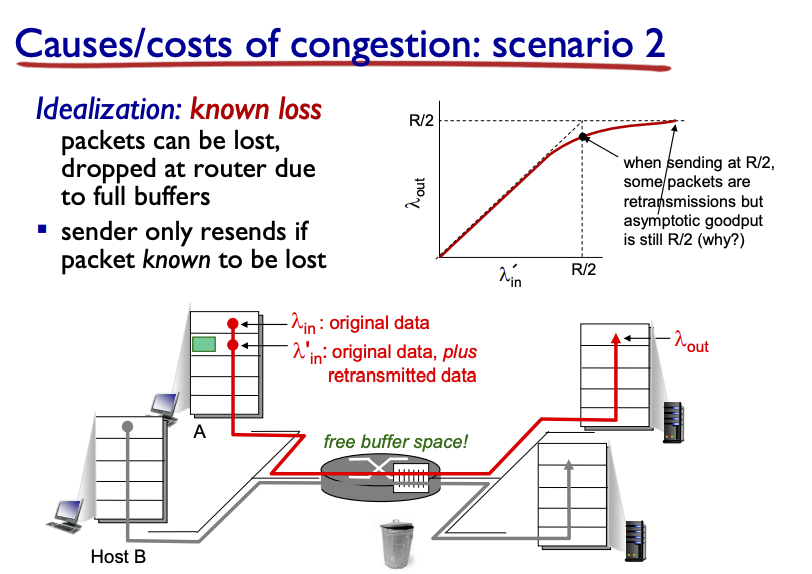
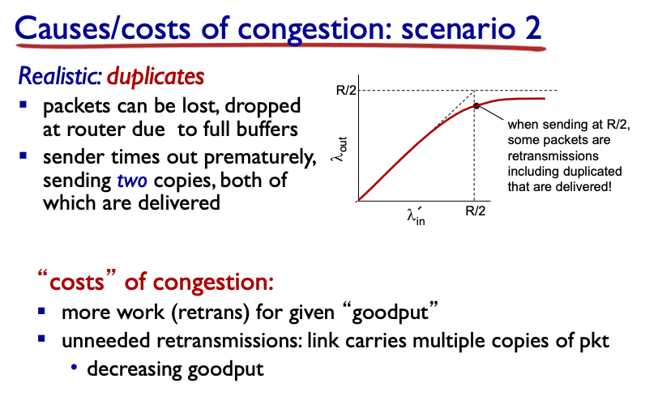
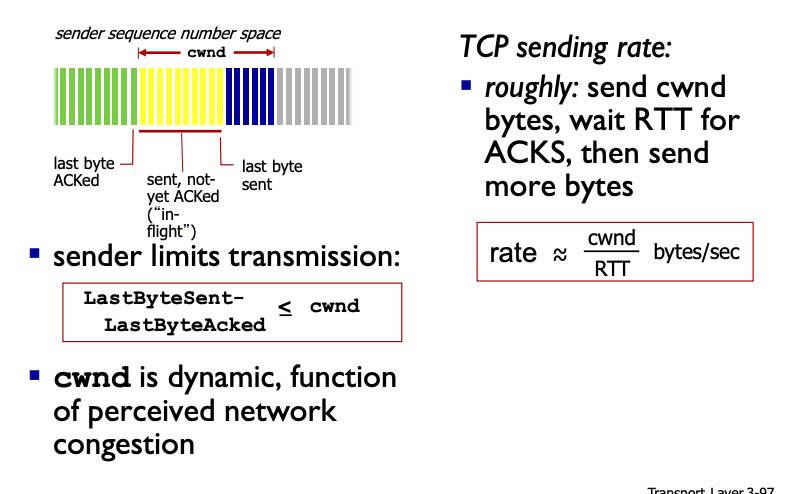

## Transport Layer

### Transport Layer Services
- logical communication between app processes running on different hosts
- run on end systems, protocols:
  - send side: break app messages into segments, pass to network layer
  - receiver side: reassembles segment into messages, passes to app layer
- 2 protocols: UDP and TCP

Transport vs Network Layer
- Network Layer: logical communication between hosts (the next layer)
- Transport Layer: logical communication between processes
  - depends on and enhances network layer services

TCP: in-order, reliable delivery
- congestion, flow and connection control

UDP: unreliable, unordered, "best-effort"

Neither has delay guarantees or bandwidth guarantees

### Multiplexing/De-Multiplexing
- multiplexing at sender: handle data from multiple sockets, add transport header
- de-multiplexing at receiver: use header info to deliver segment to proper socket
  - host receives a datagram
    - has 32 bits (source port, dest port)
    - has source/dest IP address
    - "transport layer segment"
  - host use IP addresses and port numbers for correct socket for app layer

Connection-less De-Multiplexing (UDP)
- only cares about dest port + IP
- socket has host-local port #
- when host receives UDP segment, check port # and direct
  - same dest + port # but different source will be directed to same socket

Connection based Demux (TCP) - Transmission Control Protocol
- 4 tuples (source/dest ip/port)
- use all 4 values
- web servers have different sockets for each connecting client
  - non-persistent will have different socket for each request
  - the server can be threaded

### Connection-less Transport (UDP)
- UDP -> User Datagram Protocol (RFC 768)
- connection-less = no handshaking, each segment independently handled (no state)
- streaming, DNS, SNMP
- add reliability at application layer

Segment Header
- port numbers, length (length including header, in bytes), checksum and then payload
- benefits of UDP
  - small header size
  - no congestion control - fast
  - fast in general

Checksum
- goal: detect errors (flipped bits) in transmitted segments
- sender: treat contents and header as sequence of 16 bit numbers
  - checksum made by adding everything
- receiver:
  - compute checksum of segment, check if they equal
- use 1's compliment to break it up (flip at first 0, or just add a 1 at the end + flip after)

### Principles of Reliable Data Transport
- RDT -> reliable data transfer
- based off of UDT first
- rdt_send -> udt_send -> rdt_rcv -> deliver_data
- use FSM to illustrate, build it up. consider only unidirectional

rdt1.0
- assuming underlying udt is perfectly reliable
  - no bit error and no loss of packet
- FSM of the 4 steps (packing and unpacking) should be good

rdt2.0
- underlying channel may flip bits
- use checksum to detect errors
- how to recover from errors?
- ACK - tell sender the packet was good
- NAK -> say it has errors
  - sender will resend
- new: error detection + feedback control
- problem: what if ACK/NAK is corrupted?
  - cant retransmit: duplicate, need to add sequence number to each pkt
  - stop and wait (sender)

rdt2.1
- sequence number added to pkt (only 1 and 0 needed)
- check if ACK or NAK is corrupted
  - 2x state now, check if seq has 0 or 1
- must check if received packet is duplicate
  - receiver does not know if the last ACK/NAK is received properly at sender.

rdt2.2: NAK-free
- no more NAK, include seq # of pkt being ACKed
  - sends for last pkr received OK
- duplicate ACK at sender means NAK
  - retransmit current one

rdt3.0: channels with errors and loss
- if underlying channel can also lose packets
- sender wait a reasonable amount of time for ACK
  - retransmit if no ACK received (assume loss)
- requires a countdown timer
- even when duplicate, still send an ACK with segment number

- performance is bad, because you have to wait
  - network protocol limiting use of physical resources
- Utilization: fraction of time sender busy sending
  - `L/R / (RTT + L/R)` -> no pipelining

Stop and wait operation
- RTT is needed to see if a package has successfully been received.
  - RTT + L/R

Pipelined Protocols
- pipelining: allow multiple "in-flight", yet to-be-ack pkts
  - range of sequence number needs to be increased
  - buffering at sender/receiver

Go-Back-N
- sender: have up to N unacked packets in pipeline
- receiver: cumulative ack, no ack if there's a gap
- sender has timer for oldest unacked packet (when expire, send all unacked)
- window of N (consecutive unack'ed pkt)
  - cumulative ack (ack up to which n), has a timer for the oldest one
  - transmit n and higher seq packets in window
- receiver: ACK-only: always send ACK for correctly-received pkt with highest in-order seq #
  - may have duplicate ACKs, keep track of next seq num
  - out-of-order: discard, re-ACK pkt with highest in-order seq #
- waiting for timeout usually when things fail, as the timer is only kept for the last in-order one

Selective Repeat
- have up to N unack'ed pkt, individual ack for each packet
  - have timer for each one, transmit only that one on expire
- needs to buffer pkts, for eventual in-order delivery
- individual timer, resend only when un-acked
- window: N consecutive seq #, limits the amount sent and unACKed pkts

dilemma:
- when seq number and window are the same size, then possible to have duplicate data accepted as the new one.

### 3.5 Connection Oriented Transport: TCP
- point to point, reliable byte stream and pipelined (has a window size)
- flow is controlled: sender will not overwhelm the receiver
- full duplex: bidirectional data, MSS (Max Segment size)
- handshaking required

- Sequence number: byte-stream number of first byte in segment's data
- Ack number: sequence # of next byte expected
  - cumulative ACK
- Out of order is up to implementor

TCP round trip time/timeout
- timeout > RTT, but need to estimate RTT
- SampleRTT -> measured time from segment until ACK receipt
  - ignore re-transmission
- Average several recent measurement, not just current
  - exponential weighted moving average
  - $EstimatedRTT = (1 - \alpha) \times EstimatedRTT + \alpha \times SampleRTT$
  - usually $\alpha = 0.125$
- Timeout interval: 
  - $EstimatedRTT + Safety Margin$
  - more variation = larger margin
  - Safety Margin (Deviation)
    - $DevRTT = (1- \beta) \times DevRTT + \beta \times |SampleRTT - EstimatedRTT|$
    - usually $\beta = 0.25$
  - TimeoutInterval = EstimatedRTT + 4*DevRTT

### Connection Oriented Transport: TCP
- point to point (one sender, receiver)
- reliable, in-order byte stream
- pipelined
- full duplex data - bi-directional data flow
- connection oriented
  - handshaking, checking state before sending
- flow controlled: sender does not overwhelm receiver

Q: how to set TCP timeout value?
- longer than RTT (but it varies)
- too short: timeout early, unnecessary re-transmission
- too long: slow reaction to segment loss

Q: how to estimate RTT?
- `SampleRTT`: measured time from segment transmission until ACK received
  - will vary, want to estimate RTT smoother -> average several recent measurements, not just current RTT 

TCP round trip time, timeout
- EstimateRTT = (1 - a)*EstimateRTT + a*SampleRTT
  - exponentially weighted moving average
  - influence from past becomes less and less relevant
  - usually a = 0.125

- we need a safety margin for smoothing
  - large variation in ERTT -> larger safety margin
  - estimate SampleRTT deviation from EstimatedRTT
  - DevRTT = (1 - b) x DevRTT + b x |SampleRTT - EstimatedRTT| (b usually being 0.25)
  - TimeoutInterval = EstimatedRTT + 4 * DevRTT
- obviously still not perfect

### Reliable data transfer
- TCP creates `rdt` service on top of IP's unreliable server
  - pipelined segments
  - cumulative acks
  - single retransmissions timer
- retransmissions triggered by timeout or duplicate ack
  - duplicate ack is earlier than timeout and easily indicating something went wrong

Sender events
- data received from app:
  - create segment with #, start timer (oldest unacked segment)
- expiration interval established
  - on timeout: retransmit segment that caused timeout, restart timer
- ack received
  - if ack is for previously unacked segments: update what is known to be acked, start timer for unacked segments.
- duplicate acks for when the packets arrived out of order, the duplicate ack will ask for the next one in order.
- detect lose segment via duplicate ACK -> sender often send many segments back to back
  - if lost, there will likely be many duplicates
- TCP fast retransmit
  - if sender receives 3 ACKs for same data -> resent unacked segment with smallest sequence, don't wait for timeout
- TCP rarely go to timeout (performance will be too poor if it does often)
  - timeout basically means nothing is received! way worse

Note: since ACK are cumulative, always send what is next according to ACK

#### TCP receiver
Ack generation

- if all in order, then wait before sending ACK (prevent asking for things on their way)
- if one has ACK pending, but in order, send ACK for in order segments
- Gap detected, send a duplicate ACK saying what is needed
- fills gap, send new ACK if segment filled lower end of gap

TCP fast retransmit
- time our period are long, so we don't want to wait
- detect lost segment via duplicate ACKs
  - likely sending many packets at same time, hence, if duplicates come back -> seg lost
- if 3 ACK for same data (**triple duplicate acks**)
  - resend smallest unacked segment

TCP flow control
- receiver controls the sender, so sender does not overflow receiver's buffer
- receiver tells sender how much free buffer space available `rwnd`
  - in header, default 4KB
  - sender limits amount of unacked data based on `rwnd` (in flight should not overcrowd the `rwnd` space)

Connection Management
- before data exchange, perform "handshake"
  - agree on parameters with each other

will 2 way handshake always work? No... because of delays, re-transmission etc.

3 way handshake
1. choose a initial sequence number, x, send TCP SYN msg
2. choose a initial sequence number, y, send TCP SYNACK, ACKNum = x + 1; 
3. seeing the number is x, send ACKNum y+1 (along with server data and now good to go)

TCP: closing connection
- send TCP segment with `FIN` bit `1`
- respond to `FIN` with `ACK`
  - simultaneous FIN can be handled

### Congestion Control
- too many sources sending too much data too fast for **network** to handle
  - different from flow (sender overwhelm receiver)

Problem: when resources are being shared, as one input increases and gets dropped more, then it will cause other sources to have less throughput
- higher waste too when packets are dropped

### TCP Congestion control
Sender increase transmission rate (window size), probing for usable bandwidth until loss occurs
- additive  increase (increase `cwnd` by 1 MSS every RTT until a loss)
- multiplicative decrease (cut by half during loss)

`cwnd` current window shize - dynamic, function of network congestion

initial rate is 1, then progressively (exp) get higher

TCP - detecting and reacting to loss
- timeout -> `cwnd` = 1 MSS
  - window grows exponentially like slow start, until threshold, then linear like before
- fast transmission (3ACKS)
  - RENO -> cut in half window, grow linearly
  - TAHOE -> set to 1

Switching from slow start to CA
- threshold set as half of value before timeout

TCP throughput
- function of window size and RTT
  - ignore slow start, assume always data to send
- average window size is 3/4 W
- average throughput then is 3/4 per RTT

TCP has innovated for higher speeds

Fairness: K TCP sessions should have R/K average rate (fair)
- because of additive increase an decrease allow for fair competition
- fairness with UDP is not guarenteed, does not matter to them (for streaming ie)
- parallel TCP connection can break this (ask for a lot of connection = higher rate)
  
Explicit Congestion Notification (ECN)
- network assisted congestion control
  - 2 bits in IP header (ToS field) marked by network router to show congestion
  - congestion indication carried to receiving host, receiver sets ECE bit to notify sender of congestion (passed through network)

