## Network Layer Data Plane
Network Layer
- transport segment from sending to receiving host
- sending side - encapsulate segment into datagrams
- exist in every host, router
- router have to examine header fields in all IP datagram passing through it

2 key network-layer functions:
- forwarding: move packets from router input to the right output (**data plane**)
  - process through a single router
- routing: determine route taken by packet from source to destination (**control plane**)
  - process of the whole trip from source to dest

Data plane
- local, per router function
- determine how datagram arriving on router port is forwarded to output port
- forwarding function

Control plane
- network wide logic
  - determine how datagram is routed amongst router from source to destination
    - routing algo vs SDN

Network service model
- channel transporting datagram from sender to receiver
  - individual: guarentee delivery
  - flow: in order, minimum bandwidth

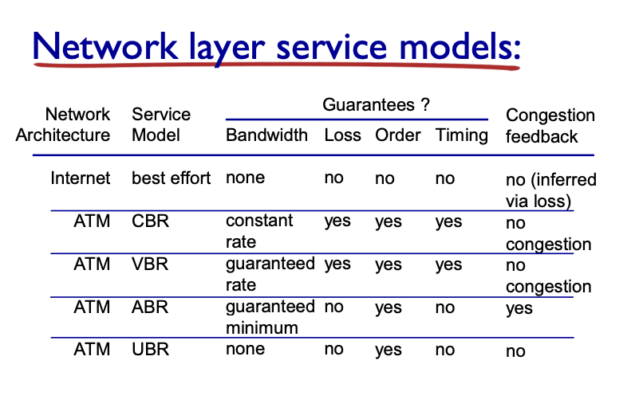

### Router Architecture Overview

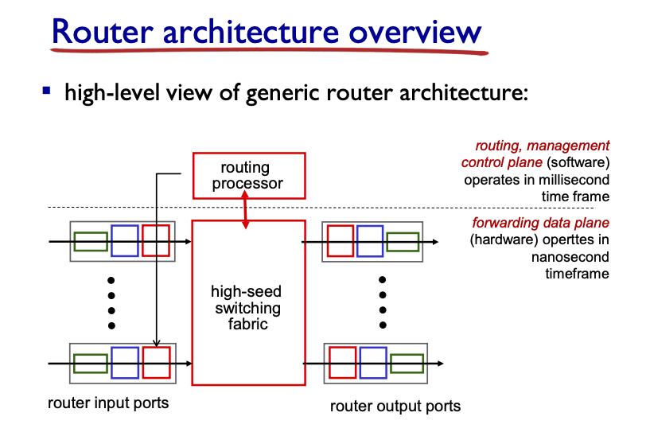

Input port functions
- bit-level reception
- data link layer (Ethernet etc.)
- decentralized switching
  - use header field values, lookup output port using forwarding table
  - goal: complete input port processing at "line speed"
  - queuing: needed when datagram arrives faster than forwarding rate
  - destination based forwarding - forward based only on destination IP address (traditional)
  - generalized forwarding - forward based on any set of header field values

Destination based forwarding
- longest prefix matching - forwarding table entry for destination address - longest address prefix that matches
- often performed using ternary content addressable memories (TCAMs)
  - *content addressable*: present address to TCAM: retrieve address in one clock cycle regardless of table size - Cisco Catalyst: ~1M entries in TCAM

Switching fabrics
- transfer packets from input buffer to appropriate output buffer
- switching rate: rate at which packets can be transferred from inputs to outputs
  - measured as multiple of input/output line rate
  - N inputs: switching rate N times line rate desirable
- 3 types: memory, bus, crossbar

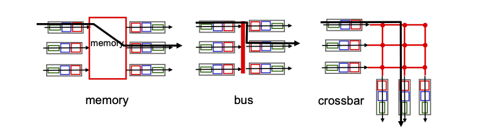

Switch via Memory
- first generation routers
- switching under direct control of CPU, packets copied to system memory
- limited by memory bandwidth (2 bus crossing)

Switch via Bus
- datagram from input port memory to output port memory via a shared a bus
- contention: switch speed limited by bus bandwidth

Switch via Interconnection network
- overcome bus bandwidth limitations
- banyan networks, cross bar, etc. 
- fragment datagram into fixed length cells, switch cell through fabric

Input port queuing
- fabric slower than input ports combined -> queuing may occur 
  - delay and loss potentially
- Head-of-the-Line (HOL) blocking: queued datagram at front prevent other from moving forward

Output ports
- buffering required from fabric faster rate
- scheduling datagram (priority scheduling, network neutrality)

Output port queuing

How much buffering?
- RFC 3439 - rule of thumb, average buffering = typical RTT times link capacity
- RTT * C / sqrt(N)
- N flows, RTT in s, C in Gbits

Scheduling mechanism
- FIFO: tail drop, priority or random
- priority scheduling - classify
- Round Robin (multiple classes, cyclically and sends a packet from each class)
- Weighted Fair Queuing
  - generalized Round Robin
  - each class gets weighted amount of service in each cycle

### Internet Network Layer

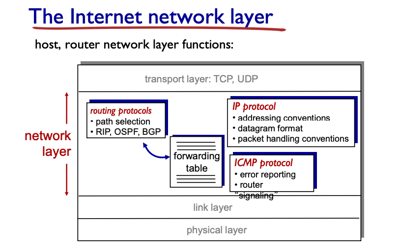

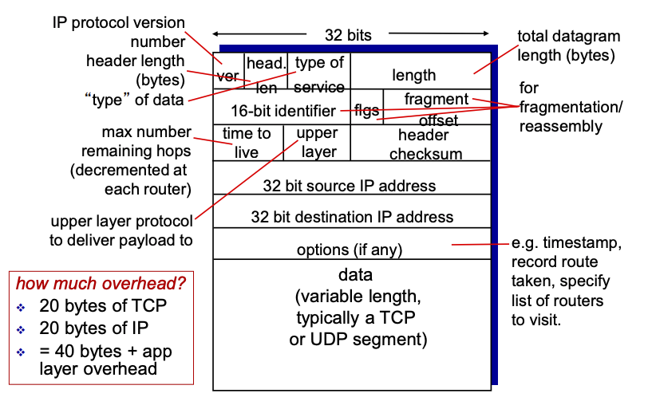

IP fragmentation, reassembly
- network link have MTU (max transfer size) - largest link-level frame
- large IP datagram divided within the net
  - one datagram becomes multiple
  - reassembled at final destination
  - IP header bits used to identify, order related fragments

example: 4000 byte datagram
- MTU = 1500 bytes
- length changes, fragflag = true, offset changes, ID is the SAME

### IP addressing
IP address: 32 bit identified for host, router interface
- connection between host/router and physical link
  - multiple interfaces (wired vs wireless)
  - IP address associated with each interface!!

Subnets
- IP adress: subnet part - high order bit, host part - lower order bit
- (192.0.0.1) -> 1 -> subnet part
- device interfaces with same subnet part of IP address
- can physically reach each other without intervening router

Recipe: determine the subnet, detach each interface from its host, create an island of isolated network
- use a subnet mask: /24

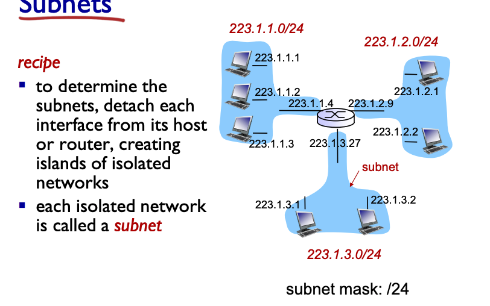

CIDR - Classless InterDomain Routing
- x is # of bits in the subnet portion of address
  - a.b.c.d/x

How to get IP address
- hard-coded by system admin by file
- DHCP - Dynamic Host Configuration Protocol
  - plug and play: dynamic get assigned from server

### DHCP
- allow hosts to dynamically get IP from network
  - renew if in use, allow for reuse of address, support for short term user
- overview
  - DHCP discover - broadcast, optional
  - DHCP offer - response, optional
  - DHCP request - request IP address
  - DHCP ack - respond with address

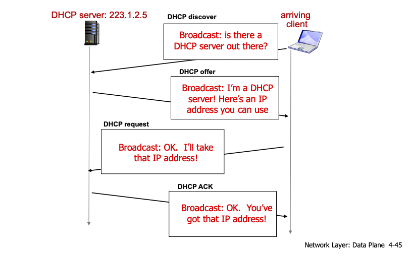

DHCP - more than just IP
- return more than just allocated IP address
  - address of first-hop router
  - name and IP address of DNS server
  - network mask (network vs host portion of address, basically the x number)

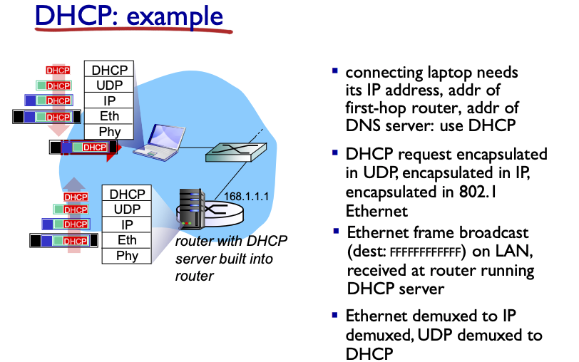

How does network get a subnet part of IP address?
- ISP allocate a portion of its address space to you

Hierarchical addressing: route aggregation
- efficient advertisement of routing information

How does IP get block of address: ICANN (internet corp for assigned name and numbers)
- allocate addresses, manage DNS and assign domain names

### NAT: network address translation
- all datagram leaving local network have same single source NAT IP address through the router, with different port numbers
- All datagram within the source/destination within network have another different IP address and subnet

Why?
- local network uses just 1 IP address for all outside world
  - range of IP addresses not needed from ISP - 1 for all devices
  - more flexible, adds a layer so that changing ISP/internal device does not matter
  - no direct access

implementation
- must replace outgoing/incoming datagrams (source IP, port)
- remember every translation pair

NAT (Network Address Translation)
- 16 bit port number field
  - 60k simultaneous connections with single address
- controversial: router should only process up to layer 3
  - shortage issue solved by IPv6, no need
  - violate end to end argument (need to care about NAT for P2P just in case)
  - what if server is behind a NAT?

### IPv6
- initial motivation: 32 bit address space not enough
  - header format helps speed processing/forwarding
  - facilitate better QoS

IPv6 format
- 40 byte header
- no fragmentation allowed

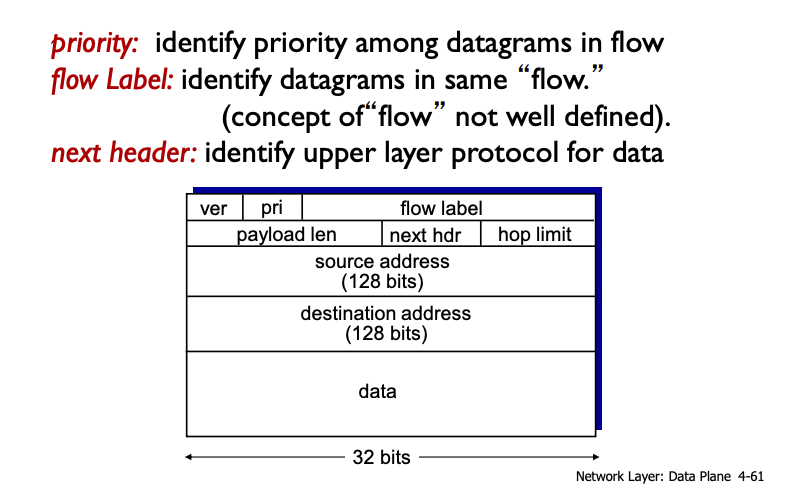

Transition from IPv4 to IPv6
- not all routers can be upgraded simultaneously
- **tunneling** IPv6 carried as payload in IPv4 datagram
  - wraps the IPv6 message with a IPv4 src and dest (where it gets unwrapped)

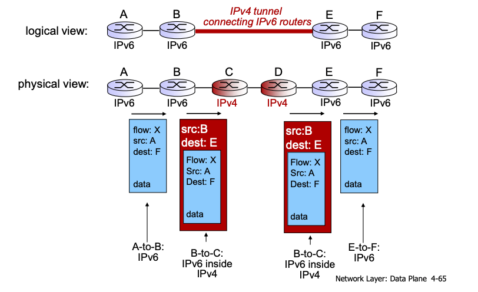

Adoption is super slow, 20 years and counting! just 8% of Google traffic

### Generalized Forwarding and SDN
each router has a *flow table* that is computed and distributed by a centralized controller

OpenFlow data plane abstraction
- flow: defined by header field
- pattern, action, priority (for tie breaker) and counters (# bytes or packets)

dest of *.*.*.* -> send to controller

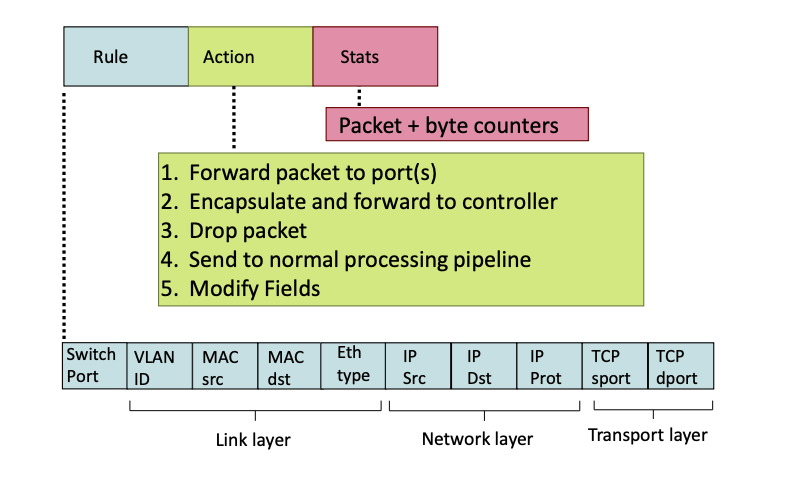

OpenFlow abstraction
- match + action unifies all kind of services
- Router: match prefix and forward
- Switch: match MAC -> foward or flood
- Firewall: allow or block
- NAT: rewrite