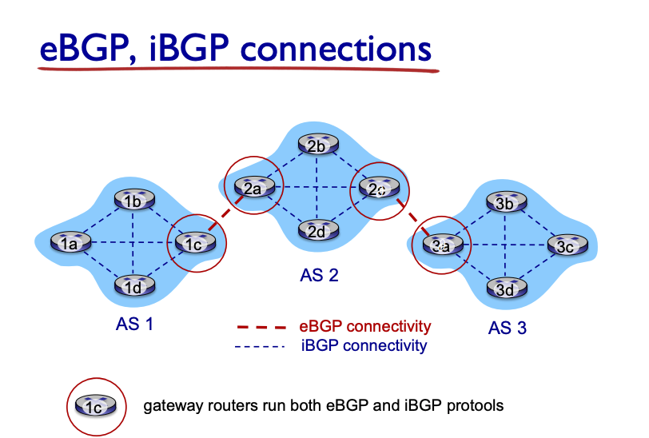

2 approaches
- traditional: per router control
- software defined networking: logically centralized control

Per-router control plane
- each routing algo component in *each and every* router interact with each other to compute forwarding tables

Logically centralized control plane
- distinct (remote) controller that interact with local control agents (CA) to compute tables

Routing protocols
- Routing goals: determine good path (routes) from sending to receiving through routers
- a really difficult challenge

Network = Graph with Nodes and Edges

Routing Algorithm classification
- information
  - global: all router have complete topology, link cost info (know everything)
    - link state algo
  - decentralized: router knows neighbor and costs of neighbor
    - iterative process of computation
    - distance vector algo
- static vs dynamic
  - static: rarely changes
  - dynamic: periodic changes, respond to link cost changes

## Link state routing algo
- Dijkstra algo
- compute least cost paths from one node to all other (forwarding table)
- initially if unknown, set to inf
- when a node is chosen next (smallest cost) then no longer need to compute it
- tie breaker can be random
- O(nlogn)

## Distance Vector Algo
- Bellman Ford algo
- greedy at each step makes the best outcome (since non-zero)
- $D_x(y) = min \{c(x,y) + d_v(y)\}$
- maintains all neighbor's distance vectors
- key idea
  - time to time, each node send own distance vectors to others
  - when they get new ones, update old ones
- iterative and async
- distributed, node only notify neighbor when DV change

Distance Vector: link cost changes
- link cost changes
- good news travels fast, bad news travel slow (if something goes up in cost, takes many iteration to settle)
  - because all route depends on each other so when things go down

Count to infinity problem
- basically they will keep updating each other with the new increased costs - counting to infinity ( A <-> B <-> C )

LS vs DV
- message complexity - O(nE) for LS, hard to tell for DV
- speed of convergence - O(n^2) needs O(nE) messages for LS, hard to tell for DV - may have loops
  - count to infinity problem for DV
- robustness (what happens during malfunction)
  - LS: node may advertise wrong link costs, node compute own table
  - DV: node can advertise wrong path cost, used by each other, propagates more

### Making routing scalable
- scale too large, billions of data cannot be in tables, table exchange would swamp links
- administrative autonomy: each network admin may want to control routing in own network

Scalable routing
- aggregate router into regions - autonomous systems (AS)
  - intra-AS routing
    - routing among hosts, router in same AS, run the same intra-domain protocol
    - different AS can be different protocol
    - *gateway* router: at edge of own AS, has link to router in other AS
  - inter-AS routing
    - amongst AS, perform routing

Interconnected ASes
- forwarding table configured by both intra and inter AS routing algo
  - intra - for entries within AS
  - inter + intra determine external destination

Inter-AS tasks
- learn which destinations are reachable through each different ASes
- propagate reachability info to all router in AS1

Intra-AS tasks
- Interior Gateway Protocols (IGP)
  - RIP (Routing Information Protocol)
  - OSPF (Open Shortest Path First)
  - IGRP (Interior Gateway Routing Protocol)

OSPF - Open Shortest Path First IS-IS
- use link-state (dijkstra)
- router floods OSPF link-state advertisement to all router in entire AS (use OSPF protocol, not TCP or UDP)
- advanced
  - security: all messages authenticated
  - multiple same-costs paths allowed (vs RIP which allows just 1)
  - each link has different cost metrics for different TOS
  - hierarchical

Hierarchical OSPF
- two level: local area, backbone
  - link state advertises only in area
  - each node has detailed area topology - only direction to nets in other area
- area border routers: "summarize" distance to nets in own area, advertise to other area borders
- backbone: run OSPF routing limited to backbone
- boundary: connect to other ASes

### Internet inter-AS routing: BGP
- Border Gateway Protocol
  - the default one, holds internet together
- provides AS a mean to
  - eBGP - obtain subnet reachability info from neighbors
  - iBGP - propagate reachability information to all AS-internal router

gateway routers: both eBGP and iBGP

BGP basics
- BGP sessions: two routers (peers) exchange BGP messages over semi-permanent TCP connections
  - advertise paths to different destination network prefixes
  - "path vector protocol"

- When AS gateway router says AS3, X -> AS3 promises to forward datagram to X

Path attributes and BGP routes
- advertises prefix include the BGP attributes
  - prefix + attributes = "route"
- 2 important attributes
  - AS-PATH: list of ASes that prefix ad has passed
  - NEXT-HOP: indicate specific internal-AS router to next-hop AS
- Policy based routing
  - import policy: accept or decline path (never route through AS Y)
  - determine whether to advertise path to other neighboring ASes

advertises throughout the system, through e and then i BGP, adding prefix as you go along.

BGP messages
- exchanged between peers over TCP connection
- BGP messages
  - OPEN: open TCP connection to remote BGP peer and authenticates sending BGP peer
  - UPDATE: new path (or remove old)
  - KEEPALIVE: keep connection alive, ACKs OPEN as well
  - NOTIFICATION: report error, close as well

BGP, OSPF, forwarding table entries
- ????

BGP route selection
- router may learn about more than 1 route to AS, chose based on
  - local preference value attribute (policy)
  - shortest AS-PATH
  - closest NEXT-HOP router (Hot potato routing)
  - additional criteria

Hot potato routing
- choose least intra-domain cost (ignore the extra HOP on a inter-domain costs)

policy through advertisements
- ISP route traffic to/from customer, not to other ISP, hence does not advertise it to ISP

- dual hammed - attached to 2 networks, but may choose to not advertise to provider network the path

Why different Intra/Inter AS routing?
- policy: 
  - inter-AS: admin want to control how traffic routed, and who routes through its own net
  - intra-AS: single admin decide everything
- scale
  - hierarchical allows to save table size and save update traffic
- performance
  - inter-AS: policy may dominate over performance
  - intra-AS: focus performance

### Software Defined Networking (SDN)
- historically has been implemented via distributed, per router approach
  - monolithic router contain the hardware and runs proprietary implementation
  - have various middle boxes for network layer functions
- ~2005, maybe rethink network control plane

SDN
- why a logically centralized control plane
  - easier network management: avoid misconfiguration, better flexibility
  - table based forwarding with OpenFlow: easier programming

Traditional (algo) routing (per router) does not allow for load balancing
- SDN allow for these to happen with the OpenFlow API (flow tables)

Data plane switches
- fast, simple switches that is connected to OpenFlow with API for switch control

controller
- maintain network state information
- interact with network control application above
- distributed by default, API based to network control apps and data plane

control application
- brain
- interface layer to apps via API, network-wide state management - a distributed DB, communication layer

OpenFlow (revisited)
- between controller and switch, TCP to exchange messages
  - controller to switch, async (switch to controller) and symmetric (misc)
- controller to switch messages
  - features: queries features
  - configure: query and set configurations
  - modify-state: add/delete/modify entries
  - packet-out: sent packet out of the switch port
- switch to controller messages
  - packet-in: transfer packet to controller
  - flow-removed: deleted at switch level
  - port status: inform controller changes on port

Switch needs to alert link failures

ODL (OpenDaylight) controller
- network apps may be within or outside controller

ONOS controller
- control apps are outside
- focused ona  distributed core: reliability and performance scaling

Challenges
- robustness to failures: leveraging reliable distributed systems
- meeting specific requirements

### ICMP - Internet Control Message Protocol
- used by hosts and routers to communicate network level information (errors: unreachable hosts, etc.)
- network-layer "above" IP - within IP datagrams
- `type, code, first 8 bytes of IP datagram causing error`

### Network Management
- autonomous systems (networks): control a network at a reasonable cost

managed devices contain managed object where the data is gathered into a Management Information Base (MIB)
- request + response
- trap message (from agent to entity), exceptional events

