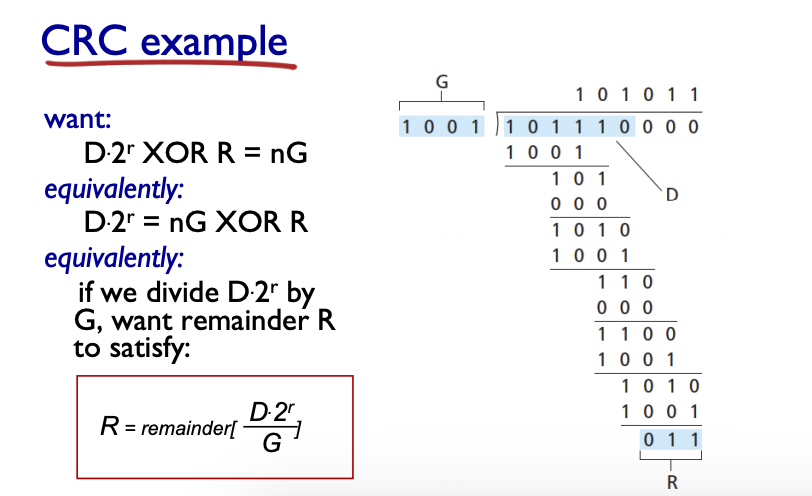
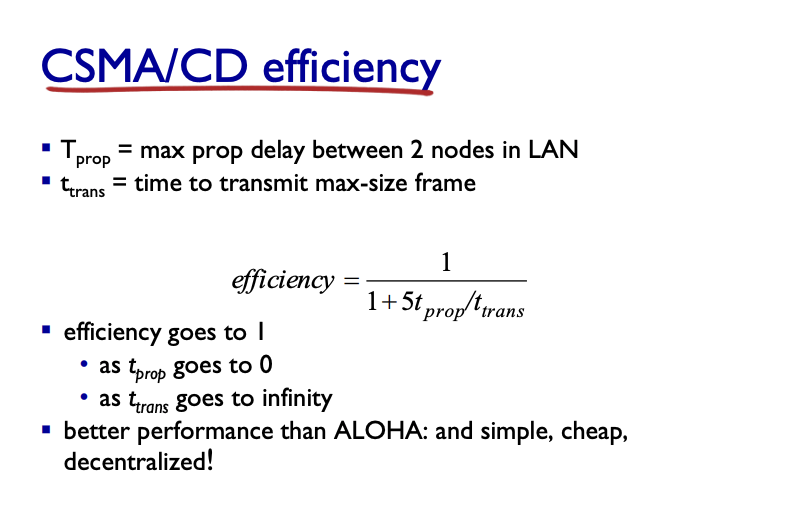
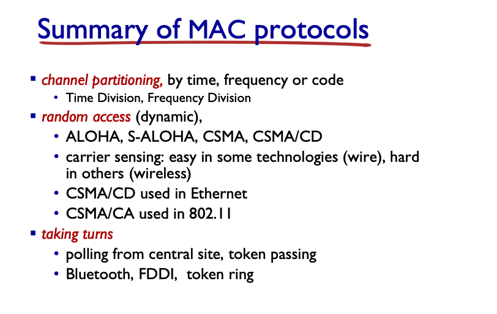

## Link Layer
- hosts and routers are nodes
- communication channels between nodes - links
    - do not differentiate between the nodes, only care about nodes
    - wired, wireless, LAN etc.
- layer-2 packet: frame, encapsulate the datagram
- data-link layer worries about the transferring datagram from one node to physical adjacent node over link

Context
- datagram transferred by different link protocol over different links
    - Ethernet, then frame relay, 802.11 last
- Each link protocol provides a different service
    - like train -> plane -> train -> car

Link Layer Services
- framing and link access
    - encapsulate datagram into frame, add header, trailer
    - channel access if shared medium (shared wiring)
    - "MAC" address in header for source and destination
        - different from IP

- reliable delivery between nodes
    - usually not needed for the low bit-error links (fiber, twisted pairs etc)
    - wireless links: high error rates
        - should you have link-level reliable deliver?
            - arguable here, should you spend resource on this?

Link Layer services
- flow control (pacing between adjacent sending and receiving nodes)
- error detection (potentially correct them without needing retransmission)
- half-duplex and full duplex
  
Where does it live?
- CPU (app, transport, network, link - data)
- Controller (link - control, physical)
- on the adapter - Network Interface Card (NIC)
- adapters communicate (encapsulate datagram into frames, add error checking bits etc.)

## Error detection
- EDC - Error Detection and Correction Bits

single bit parity: detect single bit error (add all 1s)

two dimensional bit parity: detect and correct the single bit error - can pinpoint

similar to how checksum in Transport layer works

Cyclic Redundancy Check
- view databit as a Binary number - D
- choose `r+1` bit pattern - G
- choose `r` CRC bits - R so that <D, R> is divisible by G

Note that G is r+1, hence add `r` digits of `0` behind D

### Multiple Access Links, Protocols
- point to point: PPP for dial-up
- broadcast (shared wire or medium)
    - old faction Ethernet, 802.11 wireless
  
multiple access protocols
- single shared broadcast channel may have issue with two or more transmission
- distributed algo that determines how nodes share
- communication is done within itself

MAC protocols: taxonomy
- 3 broad classes
    - channel partitioning: smaller pieces
    - random access: not divided, allow random access
    - "taking turns" nodes take turn, some can take longer time

- TDMA: time division multiple access
    - accesses channel in rounds
    - unused slots go idle

- FDMA: frequency division
    - channel divided into frequency bands, each station assigned a fixed band
    - unused transmission time is still idle

### Random access protocols
- where there s a collision what to do

Slotted ALOHA
- all frames and requal size, time divided into slots and nodes are syncronized (if more than 2 in a slot, then collision)
- if collisions, retransmit frame in each subsequent slow with prob p
- each node can send something during their slow
- pros
    - decentralized, simple and single active node can keep transferring at full rate
- cons
    - collisions waste slots
    - idle slots
    - nodes may be able to detect in collision in less time
    - needs a clock synchronization
- at best efficiency is just 37%

Pure (unslotted) ALOHA
- simpler and no synchronization
- when arrive, transfer immediately, collision occurs more
- 18% efficiency, even worse

CSMA (Carrier Sense Multiple Access)
- listen before transmit, if channel sense idle: transmit entire frame, if busy, just wait
    - DO NOT INTERRUPT 
- collisions can occur, prop delay = might not hear the transmission
    - entire packet transmission is wasted

CSMA/CD (Collision Detection)
- collisions detected within a short time, colliding transmission aborted early
- collision detection: 
    - wired LAN: measure signal strength and compare transmissed, received signals
    - hard in wireless
- after aborting, enter binary (exponential) backoff
    - choose from {1, ..., 2^m-1} * 512 bit times after `m` collision

### Taking turns MAC protocols
- look for best between channel partitioning and random access protocols
- polling: master node invites slave to transmit in turn
    - used for dumb slave devices
    - master becomes point of error
- token passing
    - control token passed from one node to the next
    - token over head, token becomes point of failure

Cable Access Network
- single CMTS transmit into multiple channels
- DOCSIS (Data over Cable)
    - FDM over upstream, downstream channels
    - TDM upstream: some slot assigned, some have contention

### MAC addresses and ARP
- 32 bit IP address
    - network layer address for interface
- MAC Address
    - used locally to get frame from one interface to another physically connected interface
    - 48 bit MAC address burned in NICROM (sometimes software settable)
    - each adapter has unique LAN address (MAC address)
- Allocation done by IEEE
    - manufacturers buy portions of MAC address space (for uniqueness)
    - MAC address: unique id
    - IP: postal code
- Address Resolution Protocol (ARP)
    - ARP table usually keep entry of <IP, MAC, TTL = 20 min>
    - kept on each node
- at each node, the datagram gets cleared from frame data (MAC addresses removed, then adds the new one for the current/next node)

### Ethernet
- dominate wired LAN technology
    - kept up over time
- bus - popular in 90s, all nodes in same collision domain
- star - popular now
    - active switch in the center, each runs a seperate Ethernet protocol and does not collide
- construct at Ethernet frame
- preamble: 7x 10101010 then 10101011 -> for synchronization
- addresses: MAC addresses
- type: IP vs AppleTalk etc.
- CRC (error check, after data)

Ethernet: unreliable and connectionless
- no handshaking between sending/receiving NICs
- unreliable, no acks
    - needs higher layer rdt
- MAC protocol: CSMA/CD with binary backoff

802.3 Ethernet standards
- many different Ethernet Standards for different frame format and medium

### Ethernet Switch
- link-layer device: take active role
    - store + forward Ethernet frames
    - transparent
    - plug and play, no need to be configured

Switch: multiple simultaneous transmissions
- switch has a switch table with MAC, interface and timestamp to each host
- Switch learns which hosts can be reached through which interfaces
- if unknown, then flood (send to every link connected)
- self learning switches can be together

Institutional Network is filled with these switches

Switch and router are similar: both store and forward
    - router on network level, switches on link level
    - both have forwarding table
        - router: from routing algorithm, IP addresses
        - switch: from flooding and learning

VLAN
- Virtual Local Area Network
- port based VLAN - switch ports grouped so that single physical switch acts as multiple

Port based VLAN
- 1-8 can reach each other only
- switches and router often sold as same device, so forwarding done there

multiple switches: trunk port - carries frame between VLANS across different switches

Multi protocol label switching (MPLS)
- high speed IP forwarding using fixed length label (instead of IP address)
    - fast lookup using fixed length ID
- MPLS uses IP, but does not ispect IP address
- MPLS path to destination can be based on source and destination
- uses labels to determine which one to go to

### Data center networks
- load balancers: applicaiton-layer routing: recieves request and direct workload accordingly
- rich interconnection: better reliability through redundancy

### Journey of a web request
- application, transport, network, link